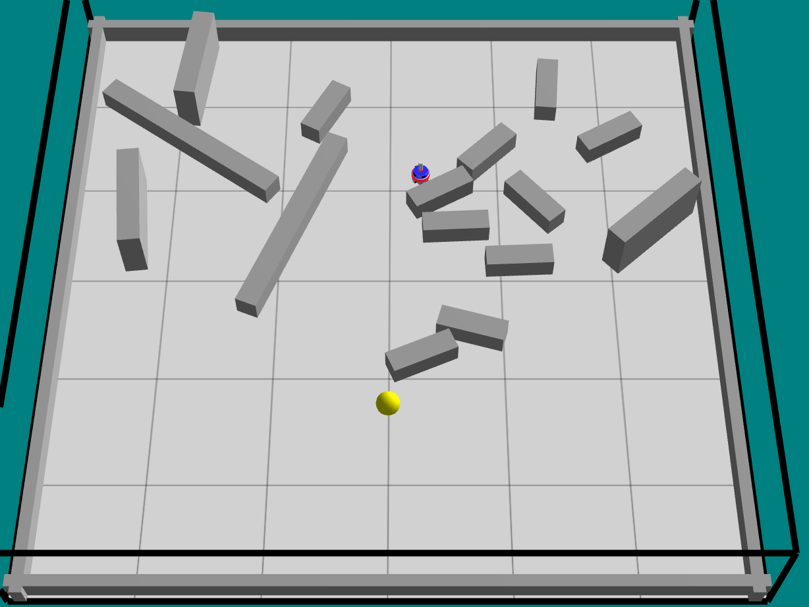
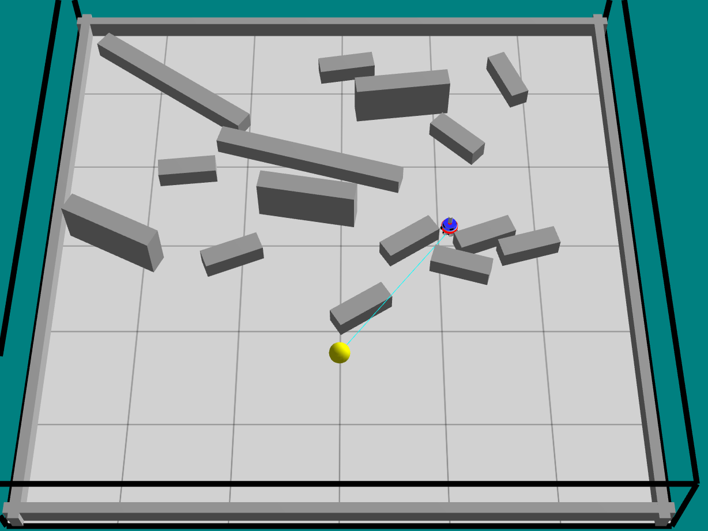

# Lab 2 Activity — Robot Obstacle Avoidance & Light Seeking

## Descrizione

In questo laboratorio l'obiettivo è **ottimizzare** il più possibile un robottino simulato in [ARGoS](https://www.argos-sim.info/).  
Il robot deve **superare gli ostacoli** posti sul percorso e **raggiungere la fonte luminosa** nel minor tempo possibile, grazie all'ausilio dei **sensori di prossimità** e dei **sensori di luce** presenti nel robot.

---

## Struttura del repository

| File | Descrizione |
|------|-------------|
| `mycontroller.lua` | Controller Lua del robot (logica di navigazione, obstacle avoidance, light seeking) |
| `run-controller.argos` | File di configurazione ARGoS (arena, ostacoli, sorgente luminosa, robot) |
| `lab-activity_2.pdf` | Specifiche dell'attività di laboratorio |
| `frame_0000000337.png` | Frame di esempio della simulazione (step 337) |
| `frame_0000000517.png` | Frame di esempio della simulazione (step 517) |
| `frame_0000000518.png` | Frame di esempio della simulazione (step 518) |

---

## Scenario di simulazione

- **Arena**: 6 × 6 metri, circondata da quattro pareti.
- **Robot**: un singolo *foot-bot* ARGoS, posizionato casualmente nella metà sinistra dell'arena.
- **Fonte luminosa**: posizionata a `(1.5, 0, 0.5)`, colore giallo, intensità 2.
- **Ostacoli**: 15 box distribuiti casualmente nell'arena (10 piccoli, 3 medi, 2 lunghi).

---

## Logica del controller (`mycontroller.lua`)

Il controller implementa una macchina a stati semplice basata su sensori vettoriali:

### Parametri principali

| Parametro | Valore | Descrizione |
|-----------|--------|-------------|
| `MAX_VELOCITY` | 15 | Velocità massima delle ruote |
| `BASE_SPEED` | 82 % di `MAX_VELOCITY` | Velocità di crociera |
| `LIGHT_WEIGHT` | 1.35 | Peso attrattivo verso la luce |
| `PROX_WEIGHT` | 1.9 | Peso repulsivo dagli ostacoli |
| `FRONT_PROX_THRESHOLD` | 0.22 | Soglia prossimità frontale per avviare la manovra di fuga |
| `ESCAPE_BACK_STEPS` | 10 | Step di retromarcia durante la fuga |
| `ESCAPE_TURN_STEPS` | 16 | Step di rotazione durante la fuga |
| `STUCK_STEPS_TRIGGER` | 10 | Step consecutivi fermi prima di dichiarare il robot bloccato |

### Stati del robot

1. **Navigazione normale** — Il robot combina il vettore della luce e il vettore di repulsione dalla prossimità per calcolare la direzione e la velocità ottimali.  
   - LED **gialli** → luce rilevata, navigazione verso la fonte.  
   - LED **blu** → nessuna luce rilevata, avanzamento di default verso destra.  
   - LED **rossi** → ostacolo rilevato, riduzione velocità.

2. **Manovra di fuga** (escape) — Attivata quando il sensore frontale supera `FRONT_PROX_THRESHOLD` oppure quando il robot risulta bloccato (`stuck_counter >= STUCK_STEPS_TRIGGER`):  
   - Retromarcia per `ESCAPE_BACK_STEPS` step.  
   - Rotazione nel verso opposto all'ostacolo per `ESCAPE_TURN_STEPS` step.  
   - LED **rossi** per tutta la durata della manovra.

3. **Anti-blocco (stuck detection)** — Ogni step confronta la posizione attuale con quella precedente; se il robot si sposta meno di `STUCK_EPS` (0.003 m) con un ostacolo vicino, incrementa il contatore. Al raggiungimento della soglia viene avviata la manovra di fuga.

---

## Prerequisiti

- [ARGoS 3](https://www.argos-sim.info/core.php) installato sul sistema.
- Plug-in ARGoS per il *foot-bot* (generalmente incluso nel pacchetto standard).

---

## Come eseguire la simulazione

```bash
argos3 -c run-controller.argos
```

La finestra Qt-OpenGL si aprirà mostrando l'arena con il robot e gli ostacoli.  
Premere **Play** (▶) per avviare la simulazione.

---

## Screenshot

| Step 337 | Step 517 | Step 518 |
|----------|----------|----------|
|  |  |  |

---

## Autore

Progetto sviluppato come attività di laboratorio per il corso di **Intelligenza Artificiale / Robotica**.
